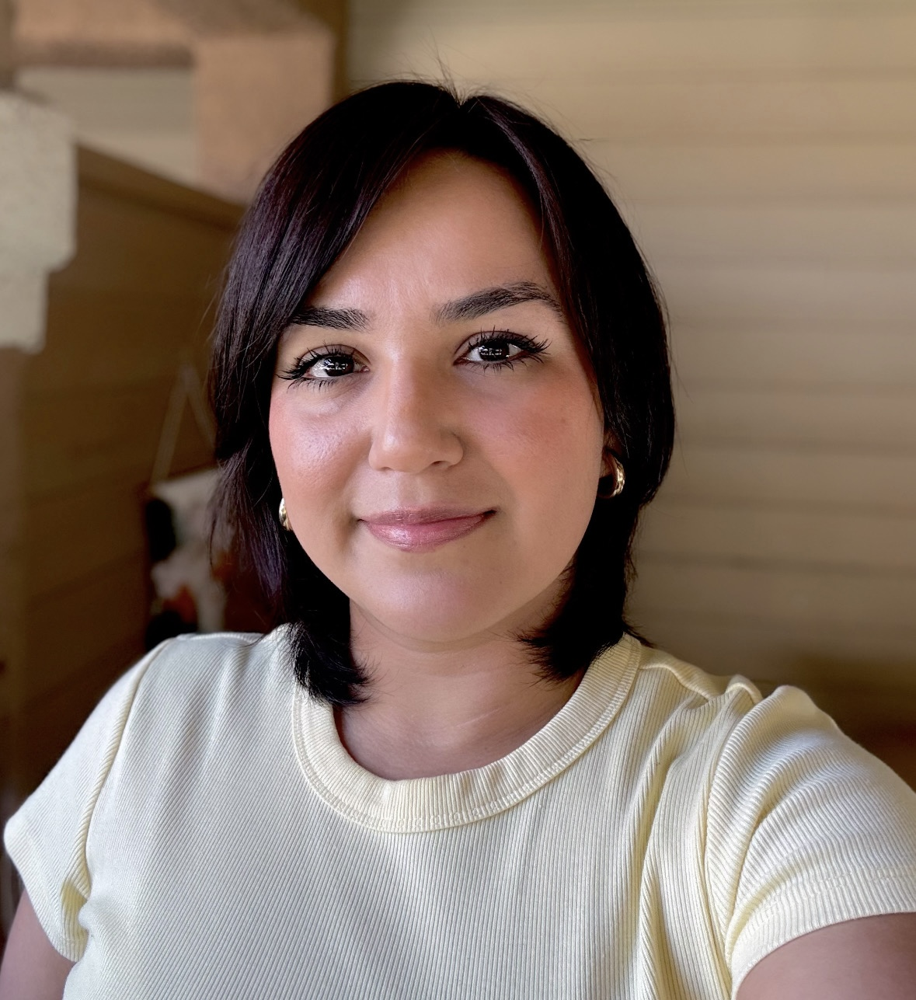
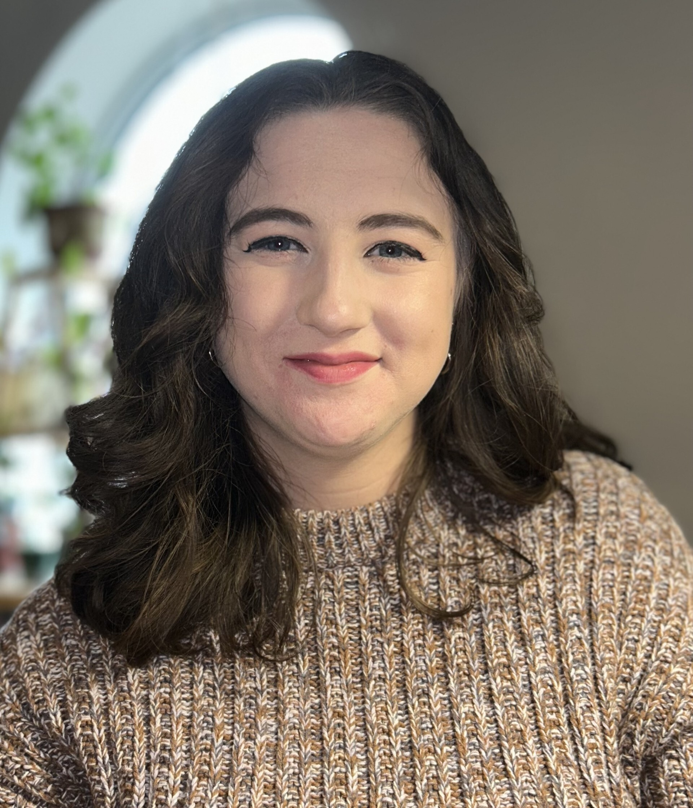
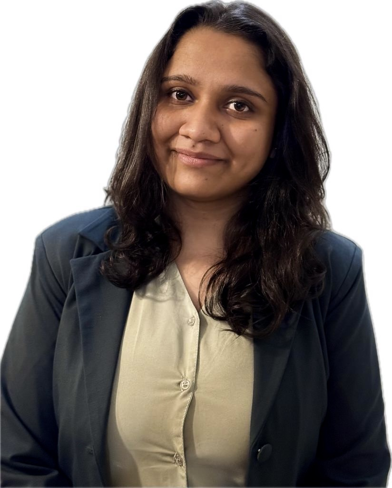
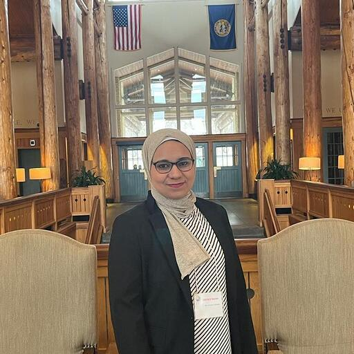
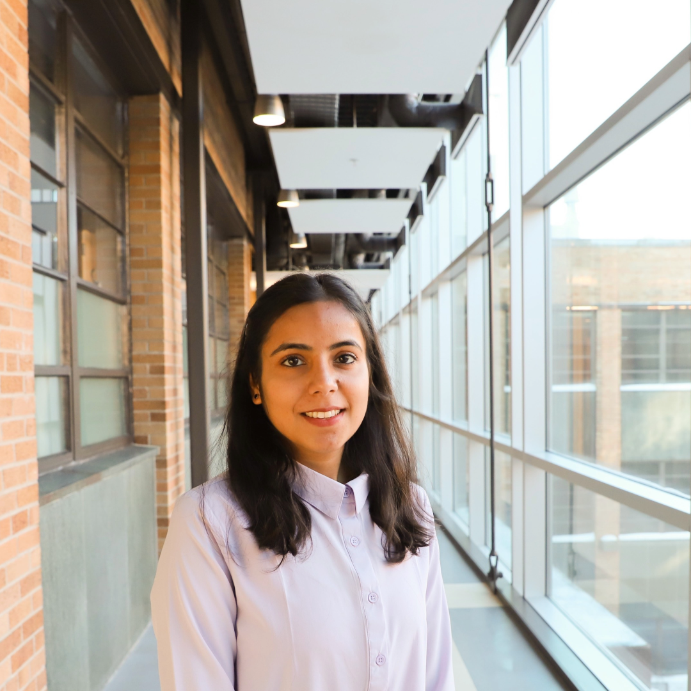
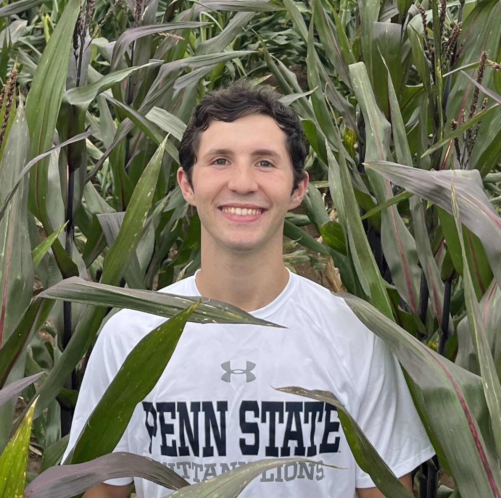

| | **Name** | **Title**| **CV** | **ORCID**
|{:width="120" align="middle"}|[James Schnable](/peoplepages/jschnable/)|Professor|[CV](/CVs/JSchnable.pdf)|0000-0001-6739-5527|
|{:width="120" align="middle"}|[Vladimir Torres-Rodriguez](/peoplepages/Vlad/)|Research Assistant Professor|[CV](/CVs/CV_Vladimir3.pdf)|0000-0001-6056-3452|
|{:width="120"}|[Zhongjie Ji](/peoplepages/ZhongjieJ.md/)|Heuermann Research Fellow|[CV](/CVs/CV_ZhongjieJ.pdf)|0009-0006-1448-305X|
|{:width="120"}|[Jon Turkus](/peoplepages/JonT.md/)|Lab Manager||0000-0002-2006-0137|
|{:width="120" align="middle"}|[Rossy Bedolla](/peoplepages/Rossy.md/)|Office Associate|[CV](/CVs/CV-RossyB.pdf)|
|{:width="120"}|[Chidanand "Chidu" Ullagaddi](/peoplepages/Chidu/)|Technician|[CV](/CVs/CV_Chidanand.pdf)|0009-0009-4005-3282|
|{:width="120"}|[Kyle Linders](/peoplepages/KyleL.md/)|Technician|[CV](/CVs/CV_KyleL.pdf)|0009-0006-9206-3608|
|{:width="120"}|[Jensina Davis](/peoplepages/Jensina/)|PhD Student|[CV](/CVs/CV_JensinaDavis-2.pdf)|0009-0000-3638-9482|
|{:width="120" align="middle"}|[Nikee Shrestha](/peoplepages/Nikee/)|PhD Student|[CV](/CVs/CV_NikeeS.pdf)|0000-0003-4195-7549||
|{:width="120"align="middle"}|[Waqar Ali](/peoplepages/Waqar/)|PhD Student|[CV](/CVs/WaqarAliCV.pdf)|0009-0001-8822-0950|
|{:width="120"}|[Harshita Mangal](/peoplepages/HarshitaM.md/)| PhD Student|[CV](/CVs/CV_HarshitaM.pdf)|0009-0002-8424-6026|
|{:width="120"}|[Amany Gomaa](/peoplepages/Amany.md/)|PhD Student _(co-advised)_|[CV](/CVs/CV_AmanyG.pdf)|0000-0002-7309-5229|
|{:width="120”align="middle"}|[Sofiya Arora](/peoplepages/Sofiya/)|MS Student|[CV](/CVs/CV_SofiyaA2.pdf)|0009-0004-5357-6094|
|{:width="120"}|[Ryleigh Kirby](/peoplepages/RyleighK.md/)|Bachelors/UCARE Student|[CV](/CVs/CV_RyleighK.pdf)||
|{:width="120"}|Jordan Bares|Undergraduate Research Assistant|||
|{:width="120”align="middle"}|[Charlie Colvin](/peoplepages/Charlie-Colvin.md/)|Crop-to-Food Innovation REEU Program|[CV](/CVs/Charlie-Colvin.pdf)|0009-0002-1316-6563|
{:.table100.ver1}

[Lab Alumni 2014-Present](/alumni)
