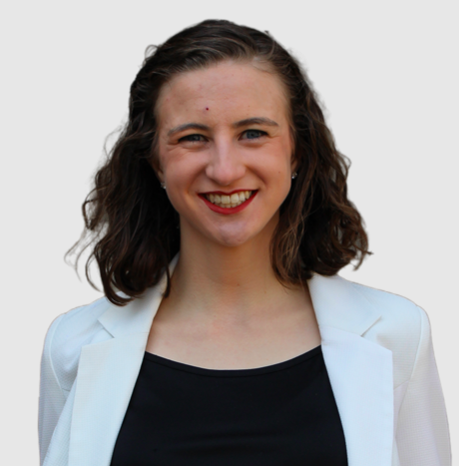
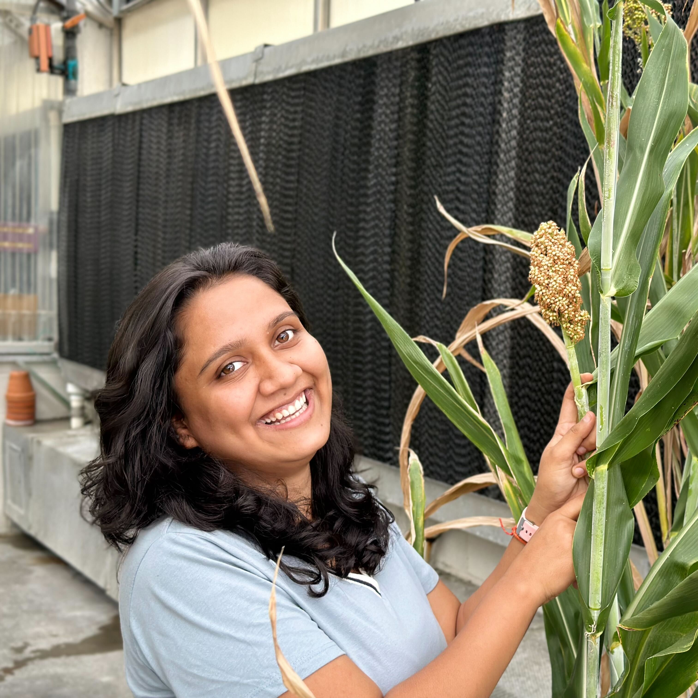

| | **Name** | **Title**| **CV** | **ORCID**
|{:width="120" align="middle"}|[James Schnable](/peoplepages/jschnable/)|Professor|[CV](/CVs/JSchnable.pdf)|0000-0001-6739-5527|
|{:width="120" align="middle"}|[Vladimir Torres-Rodriguez](/peoplepages/Vlad/)|Research Assistant Professor|[CV](/CVs/CV_Vladimir-2.pdf)|0000-0001-6056-3452|
|{:width="120"}|Zhongjie Ji|Heuermann Research Fellow|||
|{:width="120"}|Jon Turkus|Lab Manager||0000-0002-2006-0137|
|{:width="120" align="middle"}|[Rossy Bedolla](/peoplepages/Rossy.md/)|Office Associate|||
|{:width="120"}|[Chidanand "Chidu" Ullagaddi](/peoplepages/Chidu/)|Technician|
|{:width="120"}|Kyle Linders|Technician|
|{:width="120"}|[Jensina Davis](/peoplepages/Jensina/)|PhD Student|[CV](/CVs/JensinaDavisCV.pdf)|ORCID 0009-0000-3638-9482|
|{:width="120" align="middle"}|[Nikee Shrestha](/peoplepages/Nikee/)|PhD Student|[CV](/CVs/NikeeShresthaCV.pdf)|0000-0003-4195-7549||
|{:width="120"align="middle"}|[Waqar Ali](/peoplepages/Waqar/)|PhD Student|[CV](/CVs/WaqarCV.pdf)||
|{:width="120"}|Harshita Mangal| PhD Student|||
|{:width="120"}|[Fangyi Li](/peoplepages/FangyiLi/)|PhD Student _(co-advised)_|[CV](/CVs/FangyiLiCV.pdf)||
|{:width="120"}|[Hongyu Jin](/peoplepages/Hongyu_Jin/)|PhD Student _(co-advised)_|[CV](/CVs/HongYuJinCV.pdf)||
|{:width="120"}|[Amany Gomaa](/peoplepages/Amany.md/)|PhD Student _(co-advised)_|[CV](/CVs/AmanyGomaa.pdf)||
|{:width="120”align="middle"}|[Sofiya Arora](/peoplepages/Sofiya/)|MS Student|||
|{:width="120"}|Ryleigh Grove|Bachelors/UCARE Student|||
|{:width="120"}|Karla M. Cuellar Perez|Bachelors student|||
|{:width="120"}|Khang Hoang|Visiting Scientist|||
|{:width="120"}|Caner Yavuz|Visiting Scientist|||
|{:width="120"}|[Niranjan Pokhrel](/peoplepages/Niranjan.md/)|Rotating PhD Student Complex Biosystems|Fall 2024|||
|{:width="120"}|Jordan Bares|Undergraduate Research Assistant|||
{:.table100.ver1}

[Lab Alumni 2014-Present](/alumni)
